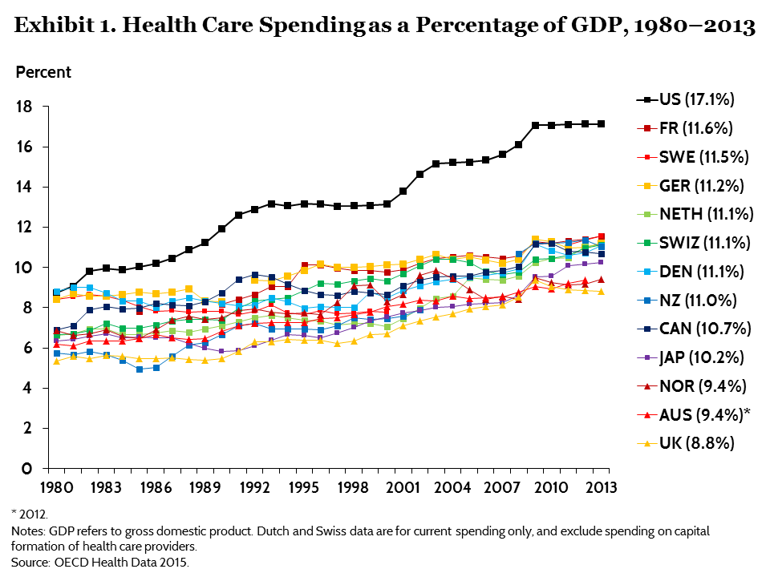

```{r setup, include=FALSE}
knitr::opts_chunk$set(echo = TRUE)
```


```{r, message=FALSE, warning=FALSE, echo=FALSE}
library(tidyverse)
library(mi)
library(extracat)
library(choroplethr)
library(choroplethrMaps)
library(plotly)
library(scales)
library(lubridate)
```

```{r message=FALSE, warning=FALSE, paged.print=FALSE, echo=FALSE}
data_2011 <- read_csv('Data/Medicare_Provider_Charge_Inpatient_DRG100_FY2011.csv')
data_2012 <- read_csv('Data/Medicare_Provider_Charge_Inpatient_DRG100_FY2012.csv')
data_2013 <- read_csv('Data/Medicare_Provider_Charge_Inpatient_DRG100_FY2013.csv')
data_2014 <- read_csv("Data/Medicare_Provider_Charge_Inpatient_DRGALL_FY2014.csv")
data_2015 <- read_csv("Data/Medicare_Provider_Charge_Inpatient_DRGALL_FY2015.csv")
data_2016 <- read_csv("Data/Medicare_Provider_Charge_Inpatient_DRGALL_FY2016.csv")

data_2011$Year <- 2011
data_2012$Year <- 2012
data_2013$Year <- 2013
data_2014$Year <- 2014
data_2015$Year <- 2015
data_2016$Year <- 2016

data <- rbind(data_2011,data_2012,data_2013,data_2014,data_2015,data_2016)

rm(data_2011, data_2012, data_2013, data_2014, data_2015, data_2016)
```


# Introduction

## Questions/Motivation for choosing the topic

<font size="4">
According to [Commonwealth Fund](https://www.commonwealthfund.org/publications/issue-briefs/2015/oct/us-health-care-global-perspective) , spendings for the Healthcare Industry in the US as a percentage of the GDP is 32% higher than France. The gap can be illustrated in the following graph. 
</font>
<!--  -->
```{r fig.width=8, fig.height=8,echo=FALSE}
library(png)
library(grid)
img <- readPNG("PercentGDP.png")
 grid.raster(img)
```

<font size="4">
Medicare also contributes a lot to this cost. According to this [Forbes article](https://www.forbes.com/sites/danmunro/2012/12/30/2012-the-year-in-healthcare-charts/#1d34e95f6c8c), Annual per capita cost increases exponentially in the US as the age increases. 

```{r fig.width=8, fig.height=8,echo=FALSE}
library(png)
library(grid)
img <- readPNG("CostByAge.jpg")
 grid.raster(img)
```


The graphs above motivated us to try and understand what is driving the major costs. Are there some disease categories which are contributing a lot to those costs? We wanted to understand the efficiency of the healthcare industry. Looking at the 2nd graph motivated us to search for the Medicare dataset and understand what are some  good efficiency metrics. 


We were also interested in the mortality rate over time. This would allow us to see whether improvements in healthcare technology have decreased the overall mortality rate. The buckets of age for which mortality rate decreased over time as the years increased also intrigued us.


Another motivation for using the mortality data set is that we wanted to understand whether the medicare spending makes sense according to the Disease Categories. For example, is there a correlation between the amount spent on a disease category( or paid out on average) with the disease category having the highest death rate? 

List of team members and a description of how each contributed to the project
1. Asaf Gal
   +Heatmap of Mortality Rates
2. Ashwin Jayaraman
3. Raphael Kintzer
4. Akshat Mittal


# Description of data


## Sources of the Data


The medicare dataset was collected from the website of Centers for Medicare and Medicaid Services (CMS). The links to the dataset can be found [here](https://www.cms.gov/Research-Statistics-Data-and-Systems/Statistics-Trends-and-Reports/Medicare-Provider-Charge-Data/Inpatient.html). There is a file associated with each year. 

1. [2011](https://www.cms.gov/Research-Statistics-Data-and-Systems/Statistics-Trends-and-Reports/Medicare-Provider-Charge-Data/Downloads/Inpatient_Data_2011_CSV.zip)
2. [2012](https://www.cms.gov/Research-Statistics-Data-and-Systems/Statistics-Trends-and-Reports/Medicare-Provider-Charge-Data/Downloads/Inpatient_Data_2012_CSV.zip)
3. [2013](https://www.cms.gov/Research-Statistics-Data-and-Systems/Statistics-Trends-and-Reports/Medicare-Provider-Charge-Data/Downloads/Inpatient_Data_2013_CSV.zip)
4. [2014](https://www.cms.gov/Research-Statistics-Data-and-Systems/Statistics-Trends-and-Reports/Medicare-Provider-Charge-Data/Downloads/Inpatient_Data_2014_CSV.zip)
5. [2015](https://www.cms.gov/Research-Statistics-Data-and-Systems/Statistics-Trends-and-Reports/Medicare-Provider-Charge-Data/Downloads/Inpatient_Data_2015_CSV.zip)
6. [2016](https://www.cms.gov/Research-Statistics-Data-and-Systems/Statistics-Trends-and-Reports/Medicare-Provider-Charge-Data/Downloads/Inpatient_Data_2016_CSV.zip)


The Mortality dataset was initially can be obtained from [here](https://cod.mortality.org/COD/USA/CODinputs/USAcod.csv). The link requires a credential to access the dataset. We had to apply to get the access (Username: "hmdcod" and Password: "magali").

While working on the dataset, it was found that the data was lacking in some key areas. We emailed the creator of the dataset and she emailed us 2 new datasets that she will were recently published on the website, one that includes the aggregate data for the US and other which includes mortality rates by states:

1. [Mortality by State, split by Age, Year, and Sex](https://usa.mortality.org/uploads/lifetables/lifetables.zip on 12/7/2018.)

2. [Mortality for US aggregate, split by Cause of Death, 5-year age groups, Year, and Sex](http://www.nber.org/data/vital-statistics-mortality-data-mulitiple-cause-of-death.html)


Tabular data was received from Magali Barbieri on 12/7/2018, originally sourced from the National Bureau of Economic Research website .

## General Description of Data


To best describe the data we will differentiate between the datasets and then explain the relationship between them. 
The Medicare dataset contains the following columns:

1. DRG Definition: The code and description identifying the Medicare Severity Diagnosis Related Groups (MS-DRG). They are a classification system that groups similar clinical conditions (diagnoses) and the procedures furnished by the hospital during an inpatient stay
2. Provider Id: The provider identifier assigned to the Medicare certified hospital facility. 
3. Provider Name: The name of the provider
4. Provider Street Address: The provider’s street address
5. Provider City: The city where the provider is located
6. Provider State: The state where the provider is located
7. Provider Zip Code: The provider’s zip code
8. Provider HRR: The Hospital Referral Region (HRR) where the provider is located
9. Total Discharges: The number of discharges billed by the provider for inpatient hospital services
10. Average Covered Charges: The provider's average charge for services covered by Medicare for all discharges in the DRG. These will vary from hospital to hospital because of differences in hospital charge structures
11. Average Total Payments: The average total payments to all providers for the MS-DRG including the MS- DRG amount, teaching, disproportionate share, capital, and outlier payments for all cases. Also included in average total payments are co-payment and deductible amounts that the patient is responsible for and any additional payments by third parties for coordination of benefits
12. Average Medicare Payments: The average amount that Medicare pays to the provider for Medicare's share of the MS-DRG. Average Medicare payment amounts include the MS-DRG amount, disproportionate share, capital, and outlier payments for all cases. Medicare payments do not include beneficiary co-payments and deductible amounts nor any additional payments from third parties for coordination of benefits.


The Mortality dataset:


State mortality data is available as a separate file for each state, bucketed by 1 year, 5 years, and 10 years, for both age and year.
Each state's mortality is presented as an actuarial life table. This analysis is only focused on the qx's (probability of death within that age group).
The mortality data is segmented by sex as either "male", "female", or "both".
Population data is not available on the state level, so it is not possible to aggregate state-level mortality data to infer US aggregate mortality.
Cause of death data is not provided on the state level.


US aggregate mortality data is available in 5yr age buckets, and 1yr "year" buckets, for males, females, and both.
Death counts are provided along with the mortality rates, allowing for the population to be calculated (pop = deaths / rate)
Cause of death is also provided. The coding was provided by Magali Barbieri along with an index. This was based on the NBER coding based on ICD codes. There are 92 cause-of-death codes, which is significantly consolidated from the NBER codes, and for each code a Disease and Grouping is provided in the index. There is also an "All" code for the total for all causes of death. The dataset also includes columns showing the mortality for that cause of death as a fraction of the total mortality.
Due to the availability of population data (inferred from the rates and death counts) and disease groupings, it is possible to also infer mortality rates for entire disease groupings. There are a total of 20 disease groupings, which is possibly few enough to be able to visualize simultaneously.
No state data is provided in the dataset.

<!-- Mortality dataset prep -->

```{r message=FALSE, warning=FALSE, paged.print=FALSE, echo=FALSE}
# Creating a vector of filenames to read in
states <- c("AK", "AL", "AR", "AZ", "CA", "CO", "CT", "DC", "DE", "FL", "GA", "HI", "IA", "ID", "IL", "IN", "KS", "KY", "LA", "MA", "MD", "ME", "MI", "MN", "MO", "MS", "MT", "NC", "ND", "NE", "NH", "NJ", "NM", "NV", "NY", "OH", "OK", "OR", "PA", "RI", "SC", "SD", "TN", "TX", "UT", "VA", "VT", "WA", "WI", "WV", "WY")
filenames <- vector("character", 0)
for(s in states) {
  for(g in c("m", "f", "b")) {
    filenames[length(filenames)+1] <- paste("Data/lifetables/", s, "/", s, "_", g, "ltper_5x5.csv", sep="")
  }
}

# Reading the files into a list
files <- list()
for(n in filenames){
  files[[length(files)+1]] <- read.csv(n)
}

# Unlisting -> Converting the data in the list into a single dataframe.
# Removing unnecessary fields from the actuarial life table
# Removing ages groups above 100. Mortality at these ages is typically unreliable, and also there is no equivalent age group in the aggregate US dataset.
# Refactoring the remaining age groups so they are sequential.
combinedData <- plyr::ldply(files, data.frame)
combinedQ <- combinedData %>% select(PopName, Sex, Year, Age, qx) %>% as.tibble()
combinedQ <- combinedQ %>% filter(Age != "100-104", Age != "105-109", Age != "110+")
combinedQ$Age <- factor(combinedQ$Age, c("0", "1-4", "5-9", "10-14", "15-19", "20-24", "25-29", "30-34", "35-39", "40-44", "45-49", "50-54", "55-59", "60-64", "65-69", "70-74", "75-79", "80-84", "85-89", "90-94", "95-99"))

# Converting the qx data to be an average one-year qx within the age group. Currently it is presented as the probability of dying within that 5-year age group.
# This transformation will help the data be comparable to the US aggregate mortality data
combinedQ$qx[combinedQ$Age != "0" & combinedQ$Age != "1-4"] <- 1 - (1 - combinedQ$qx[combinedQ$Age != "0" & combinedQ$Age != "1-4"])^(1/5)
combinedQ$qx[combinedQ$Age == "1-4"] <- 1 - (1 - combinedQ$qx[combinedQ$Age == "1-4"])^(1/4)
```

<!-- Converting the mortality dataset into a mortality *improvement* dataset -->

```{r message=FALSE, warning=FALSE, paged.print=FALSE, echo=FALSE}
# The mortality rates are converted into mortality improvement rates by creating a table of qx's for every year, and then taking the difference from year to year for a particular state/ sex/ age group.
# The difference is calculated as (qx_t / qx_t-1) - 1
# The first year is omitted from the mortality improvement table, since that year has nothing to be compared against.
combinedImprov <- combinedQ %>% spread(Year, qx)
combinedImprov.orig <- combinedImprov
combinedImprov[, 5:ncol(combinedImprov)] <- 
  combinedImprov[, 5:ncol(combinedImprov)] / combinedImprov[, 4:(ncol(combinedImprov)-1)] - 1
combinedImprov <- combinedImprov[,-4]
combinedImprov %>% gather(Year, Improvement, -PopName, -Sex, -Age) -> combinedImprov
combinedImprov$Year <- as.factor(combinedImprov$Year)
```

<!-- Reading in the 5x1 data (ie 5yr "age" buckets, 1yr "year" buckets). -->
```{r message=FALSE, warning=FALSE, paged.print=FALSE, echo=FALSE}
us <- read.csv("Data/HMD-COD-USA/HMD-COD_5x1.csv") %>% as.tibble()
```


<!-- Using the index to create a table of disease codes, groupings, and full categorization ([Grouping] - [Disease]) to go along with the numeric coding in the dataset. -->
```{r message=FALSE, warning=FALSE, paged.print=FALSE, echo=FALSE}
# Storing a separate vector of diseases for each grouping
# Then, for each vector, creating a vector that repeats the name of the grouping x times (one for each disease in that grouping). This will be used to create a proper table of "code" - "disease" - "grouping" - "full categorization"
infections <- c("Tuberculosis", "Syphilis", "Infectious Gastro-enteritis", "Dysentery", "Meningococcal infection", "Septicemia", "Viral hepatitis", "HIV-AIDS", "Other infectious diseases")
infections_g <- rep("Certain infectious diseases", length(infections))
neoplasms <- c("Lip/oral cavity/pharynx", "Esophagus", "Stomach", "Colon", "Rectum", "Liver, gallbladder and bile ducts", "Pancreas", "Larynx", "Trachea, bronchus, and lung", "Skin", "Breast", "Cervix uteri", "Other uterus", "Ovary", "Prostate", "Kidney", "Bladder", "Hodgkin lymphoma", "Non-Hodgkin lymphoma", "Myeloma", "Leukemia", "Other malignant neoplasms", "Other neoplasms")
neoplasms_g <- rep("Malignant neoplasms", length(neoplasms))
blood <- c("Diseases of the blood and blood-forming organs")
blood_g <- rep("Blood", length(blood))
endocrine <- c("Diabetes Mellitus", "Overweight, obesity, and other hyperalimentation", "Other endocrine, nutritional and metabolic diseases")
endocrine_g <- rep("Endocrine, nutritional and metabolic diseases", length(endocrine))
mental <- c("Alcohol abuse", "Drug dependence, toxicomania", "Other mental and behavioural disorders")
mental_g <- rep("Mental and behavioural disorders", length(mental))
nervous <- c("Meningitis", "Parkinson's disease", "Alzheimer's disease", "Multiple sclerosis", "Other diseases of the nervous system and the sense organs")
nervous_g <- rep("Diseases of the nervous system and the sense organs", length(nervous))
heart <- c("Chronic rheumatic heart diseases", "Acute rheumatic heart diseases", "Arteriosclerotic/ischaemic and degenerative", "Hypertensive heart disease", "Pulmonary heart disease and diseases of pulmonary circulation", "Other forms of heart disease")
heart_g <- rep("Heart disease", length(heart))
cerebrovascular <- c("Cerebrovascular disease")
cerebrovascular_g <- rep("Cerebrovascular", length(cerebrovascular))
circulatory <- c("Artherosclerosis", "Aortic aneurysm", "Other diseases of arteries, arterioles and capillaries", "Other disorder of the circulatory system")
circulatory_g <- rep("Circulatory disorders", length(circulatory))
respiratory <- c("Influenza", "Other acute respiratory infections", "Pneumonia", "Chronic bronchitis", "Asthma", "Other obstructive pulmonary diseases", "Other respiratory diseases")
respiratory_g <- rep("Respiratory diseases", length(respiratory))
digestive <- c("Gastric and duodenal ulcer", "Gastro-enteritis (non-infectious)", "Chronic liver diseases and cirrhosis", "Other diseases of the digestive system")
digestive_g <- rep("Digestive system diseases", length(digestive))
skin <- c("Infections of skin and subcutaneous tissue", "Non-infectious diseases of the skin and subcutaneous tissue")
skin_g <- rep("Skin diseases", length(skin))
musculoskeletal <- c("Rheumatoid arthritis and osteoarthrosis", "Other diseases of the musculoskeletal system/connective tissue")
musculoskeletal_g <- rep("Musculoskeletal diseases", length(musculoskeletal))
genitourinary <- c("Nephritis, nephrosis and renal failure", "Infections of kidney", "Other diseases of kidney and ureter", "Other diseases of the genitourinary system")
genitourinary_g <- rep("Genitourinary diseases", length(genitourinary))
pregnancy <- c("Complications of pregnancy, childbirth and puerperium")
pregnancy_g <- rep("Pregnancy", length(pregnancy))
perinatal <- c("Certain conditions originating in the perinatal period")
perinatal_g <- rep("Perinatal", length(perinatal))
congenital <- c("Congenital malformations of the nervous system", "Congenital malformations of the circulatory system", "Other congenital malformations/anomalies")
congenital_g <- rep("Congenital malformations/anomalies", length(congenital))
unknown <- c("Senility without psychosis", "Sudden death", "Unknown and unspecified causes", "Other ill-defined or unknown")
unknown_g <- rep("Ill-defined or unknown", length(unknown))
external <- c("Motor vehicle accidents", "Accidental falls", "Accidental poisoning by alcohol", "Other accidental poisoning", "Other accidents", "Suicide", "Homicide", "Events of undetermined intent", "Other external causes")
external_g <- rep("External causes", length(external))

# Creating a single vector of all of the diseases, and also "All"
diseases <- c(infections, neoplasms, blood, endocrine, mental, nervous, heart, cerebrovascular, circulatory, respiratory, digestive, skin, musculoskeletal, genitourinary, pregnancy, perinatal, congenital, unknown, external, "All")
# Creating a single vector of all the groupings (with the appropriate repetitions), and also "All"
diseases_g <- c(infections_g, neoplasms_g, blood_g, endocrine_g, mental_g, nervous_g, heart_g, cerebrovascular_g, circulatory_g, respiratory_g, digestive_g, skin_g, musculoskeletal_g, genitourinary_g, pregnancy_g, perinatal_g, congenital_g, unknown_g, external_g, "All")
# Concatenating the groupings and diseases to come up with a full categorization ("Group" - "Disease")
diseases_g_full <- paste(diseases_g, diseases, sep=" - ")

# Putting the codes, diseases, groupings, and full categorizations into a table
codes <- data.frame(
  COD.cat = levels(us$COD.cat),
  Disease = diseases,
  Group = diseases_g,
  Group.Disease = diseases_g_full
)
```


<!-- Processing the US aggregate data (adding descriptive names to the diseases, calculating populations, removing unnecessary age groups) -->
```{r message=FALSE, warning=FALSE, paged.print=FALSE, echo=FALSE}
# First, use the coding above to put descriptive names into the dataset
us <- us %>% full_join(codes, by=c("COD.cat"))

# Add populations to the dataset (based on deaths / rates)
us %>% mutate(
  Pop.F = Deaths.F / (Rates.F / 100000),
  Pop.M = Deaths.M / (Rates.M / 100000), 
  Pop.T = Deaths.T / (Rates.T / 100000)
  ) -> us

# Remove unnecessary age groupings (ie ones that aren't in neat 5-year bands. This information is already coded in the dataset as a 5-year band for most of the groupings, and also only the 5-year bands have corresponding entries in the States data)
us <- us %>% filter(Age != "85+", Age != "90+", Age != "95+", Age != "100+", Age != "105+")

# Order the age groupings in consecutive order
us$Age <- factor(us$Age, c("0", "1-4", "5-9", "10-14", "15-19", "20-24", "25-29", "30-34", "35-39", "40-44", "45-49", "50-54", "55-59", "60-64", "65-69", "70-74", "75-79", "80-84", "85-89", "90-94", "95-99"))

us_5x5 <- us

# Remove data that is before 1960 or after 2014, as there are no corresponding entries in the States data (the number of entries lost is relatively small)
us_5x5 <- us_5x5 %>% filter(Year >= 1960, Year <= 2014)

# Add a separate coding for each year corresponding to the 5-year "year" bucket that that year is in. This will be used to convert the dataset from 1-year "year" buckets to 5-year "year" buckets, which will help smooth out statistical noise, and also make the data more comparable to the States data which is presented in 5-year "year" buckets.
us_5x5 <- us_5x5 %>% mutate(
  YearBand = ifelse(
    Year<1965, "1960-1964", ifelse(
    Year<1970, "1965-1969", ifelse(
    Year<1975, "1970-1974", ifelse(
    Year<1980, "1975-1979", ifelse(
    Year<1985, "1980-1984", ifelse(
    Year<1990, "1985-1989", ifelse(
    Year<1995, "1990-1994", ifelse(
    Year<2000, "1995-1999", ifelse(
    Year<2005, "2000-2004", ifelse(
    Year<2010, "2005-2009", ifelse(
    Year<2015, "2010-2014", NA)))))))))))
)
us_5x5$YearBand <- as.factor(us_5x5$YearBand)


# Consolidate the data into 5-year "year" bands. Then, calculate aggregate death counts and populations for those year bands by totaling the respective death counts and populations in the corresponding years.
us_5x5_t <- us_5x5 %>% group_by(YearBand, Age, COD.cat, Disease, Group, Group.Disease) %>% dplyr::summarize(
  Deaths.F.t = sum(Deaths.F, na.rm=T), 
  Deaths.M.t = sum(Deaths.M, na.rm=T), 
  Deaths.T.t = sum(Deaths.T, na.rm=T), 
  Pop.F.t = sum(Pop.F, na.rm=T), 
  Pop.M.t = sum(Pop.M, na.rm=T), 
  Pop.T.t = sum(Pop.T, na.rm=T)
)

# Calculate qx's. These must be recalculated based on the total death counts and total population for the 5-year age bands. (Cannot simply take an average of qx's since the population for each year may be different)
us_5x5_t <- us_5x5_t %>% mutate(
  qx_F = Deaths.F.t / Pop.F.t, 
  qx_M = Deaths.M.t / Pop.M.t, 
  qx_T = Deaths.T.t / Pop.T.t
  )

# Gather qx's into m/f/b (ie currently these are three separate columns, but would be easier to process the data in "tidy" form)
us_5x5_t_g <- 
  us_5x5_t %>% 
  select(YearBand, Age, COD.cat, Disease, Group, Group.Disease, qx_F, qx_M, qx_T) %>% 
  gather(Sex, qx, -YearBand, -Age, -COD.cat, -Disease, -Group, -Group.Disease)

# Rename "YearBand" to "Year" (ie same naming as in the States data, to be consistent)
us_5x5_t_g <- us_5x5_t_g %>% dplyr::rename(Year = YearBand)

# Rename qx's to "m"/"f"/"b"
us_5x5_t_g$Sex[us_5x5_t_g$Sex=="qx_F"] <- "f"
us_5x5_t_g$Sex[us_5x5_t_g$Sex=="qx_M"] <- "m"
us_5x5_t_g$Sex[us_5x5_t_g$Sex=="qx_T"] <- "b"

# Make "sex" into factor data
us_5x5_t_g$Sex <- as.factor(us_5x5_t_g$Sex)

```


<!-- Converting the mortality dataset into a mortality improvement dataset -->
```{r}
# Converting the mortality into mortality improvement by spreading out the mortality rates over all years, and taking the difference between years (qx_t / qx_t-1 - 1). Dropping the first year group because there are no mortality rates to compare it to (since it is the first).
us_5x5_t_g_Improv <- us_5x5_t_g %>% spread(Year, qx)
us_5x5_t_g_Improv[, 8:ncol(us_5x5_t_g_Improv)] <- 
  us_5x5_t_g_Improv[, 8:ncol(us_5x5_t_g_Improv)] / us_5x5_t_g_Improv[, 7:(ncol(us_5x5_t_g_Improv)-1)] - 1
us_5x5_t_g_Improv <- us_5x5_t_g_Improv[,-7]
us_5x5_t_g_Improv <- us_5x5_t_g_Improv %>% gather(Year, Improvement, -COD.cat, -Disease, -Group, -Group.Disease, -Sex, -Age)
```


# Analysis of data quality


## Description of Data Quality


There were some missing values for the cost of providers in the data. This can be visualized using the visna package:


```{r fig.height=10, fig.width=10}
visna(data)
```

We could see that there were 2 types of missing patterns in the medicare dataset.


1. The first pattern where all the column values were missing except for year. There were 4,147 such instances from the 1,080,374 rows. This contributed to 0.3% of the total data and all occured in the year 2013. 
2. The second pattern was where only the column Total Discharges was missing. These occurred in 41 rows in the dataset. 


We decided to ignore these rows since their contribution to the overall data was approximately 0.3%. As a result, our data for analysis consisted of 1,076,186 rows. 


Certain Diagnosis Related Groups only started appearing from the year 2014. There were 637 total Diagnosis Related Groups most of which were pretty similar. For example, there were Diagnosis Related Groups like


1. Heart Transplant Or Implant Of Heart Assist System W MCC
2. Heart Transplant Or Implant Of Heart Assist System W/O MCC


While researching online, we found out that the difference between the two was that one consisted of Heart Transplant on a person with Multiple Chronic Conditions and the other consisted of a Heart Transplant on a person without Multiple Chronic Conditions. These 2 DRGs were pretty similar to us and we decided to map them according to the diagnosis categories. 


We mapped the DRGs to the Diagnosis Categories using the following [source](https://en.wikipedia.org/wiki/Major_Diagnostic_Category).


While plotting the trend over time, we saw that CMS did not include certain DRGs before the year 2013. This can be visualized in the graph below, where each color is a different DRG:

```{r echo=FALSE, message=FALSE, warning=FALSE}
#Loading cleaned data
data <- read_csv('Inpatient_Cost.csv')
```


```{r fig.height=10, fig.width=15}


filtered_data <- data  %>% group_by(Diagnostic_category, Year) %>% 
  dplyr::summarize(Average_Cost = sum(Total_Payments)/sum(`Total Discharges`)) %>% mutate(count = n())

ggplot(filtered_data, aes(x=Year, y=Average_Cost, color =Diagnostic_category )) + geom_line() +
  xlab('Year') + ylab('Average Cost') + ggtitle('Average Cost Trend by Diagnostic Category')
```


For the state mortality dataset, there were no NAs or missing values. The US aggregate dataset also had no NAs. However, for many age groups there were 0 deaths, and many causes of death had no records prior to certain years, such as HIV-AIDS prior to the 1980s. Essentially, this means that deaths occurring due to HIV-AIDS prior to the 1980s were either nonexistent or would have been coded as something other than HIV-AIDS (such as “Other infections” or “Other unexplained”). However, it is unlikely that any significant number of deaths are actually “missing” from the dataset, since deaths data are usually unambiguous (dead or not dead) and carefully recorded by government agencies. Therefore, the data can be considered usable and representative.


# Main analysis


## Findings


We first decided to see how the costs varied by State in the US. Cleaning the cost variables by removing the ‘$’ and the ‘,’ in the dataset, we used the choropleth package to plot the same:


```{r echo=FALSE}
data(state.regions)
drg_grouped_by_year <-  data %>% group_by(`Diagnostic_category`, `Year`,`Provider State`) %>%
  summarise(Count_Discharge = sum(`Total Discharges`),Sum_Amount = sum(`Total_Payments`))

drg_grouped_by_year  <- drg_grouped_by_year  %>% group_by(`Year`) %>% mutate(Percent_Discharges = 100 * Count_Discharge/sum(Count_Discharge),
                                                                             Percent_Cost = 100 * Sum_Amount/sum(Sum_Amount))

total_cost_by_state <- drg_grouped_by_year %>% dplyr::group_by(`Provider State`) %>% 
  dplyr::summarise(Total_Discharges = sum(Count_Discharge),Total_Cost = sum(Sum_Amount))

total_cost_by_state$Average_Cost <- total_cost_by_state$Total_Cost/total_cost_by_state$Total_Discharges
colnames(total_cost_by_state)[1] <- 'State'

total_cost_by_state$region <- plyr::mapvalues(total_cost_by_state$State, from = state.regions$abb, to = state.regions$region)
total_cost_by_state$value <- total_cost_by_state$Average_Cost

```

```{r fig.height=10, fig.width=10}
state_choropleth(total_cost_by_state,title = "Average Cost by State",
                 legend = "Average Cost")
```


As expected, we noticed that California and New York have a high average cost of treatment. This can be attributed to the high cost of living in those states. On the other hand, Florida having such a low average cost seems to indicate that the treatments are generally cheaper in that state. 


We then investigated the total number of discharges by state:


```{r fig.height=10, fig.width=10}
total_cost_by_state$value<- total_cost_by_state$Total_Discharges
state_choropleth(total_cost_by_state,title = "Total Discharges by State",
                 legend = "Total Discharges")
```


As we can see, the overall number of discharges in Florida is actually quite high and are in the similar bucket to California and New York. 

The map showing discharges also indicates the population density of the US. States with high populous have a high number of discharges. 

When we compared this choropleth graph of Total Discharges by State to the previous graph Average Cost by State there were a few notable things. First, excluding New York and California the graphs are almost inversely related. The states with the highest number of discharges were actually the states with lower average cost. 

This comparison led us to explore further breakdowns within each DRG for each state which could shed a little light as to why there is an inverse relationship. Based on these two graphs we also wondered whether a further breakdown of the DRG’s amongst the states could expose disparity between the states for a given DRG.  In short, these first two choropleths  showed us that the data did not follow the trends we would expect and required us to dive deeper in to the differences between states.  This realization was the main motivation towards building our interactive map. 


Our next question was on which Diagnoses Related Groups are the most expensive on average?

To accomplish the above task, we bucketed the DRGs by their general categories based on codes provided by CMS. The graph can be seen below


```{r echo = FALSE}
drg_cost <- drg_grouped_by_year %>% group_by(`Diagnostic_category`) %>% 
  dplyr::summarise(Average_Cost = sum(Sum_Amount)/sum(Count_Discharge))

```


```{r fig.height=10, fig.width=10}

ggplot(drg_cost, aes(x = reorder(Diagnostic_category,Average_Cost) ,y = Average_Cost)) + 
         geom_col() + scale_y_continuous(labels = function(l) { paste0(l/1000, "K")}) +
  coord_flip() + ylab('Average Cost') + xlab('DRG') + ggtitle('Average Cost by DRG')

```


Some key takeaways from the above graph:

Heart and Transplant are significantly more expensive than all other DRGs. There are many possibilities as to why this is occuring. One possibility is that the procedure is simply more expensive because it requires more resources (doctors, nurses, hours in hospital, medication, surgery etc.) Another possibility could be that there are fewer cases for these treatments and those treatments are significantly more expensive and have an outsized effect on the category average.  

This motivated us to see the similar graph for the number of discharges


```{r fig.height=10, fig.width=10}
drg_discharge <- drg_grouped_by_year %>% group_by(`Diagnostic_category`) %>% 
  dplyr::summarise(Discharge = sum(Count_Discharge))

ggplot(drg_discharge, aes(x = reorder(Diagnostic_category,Discharge) ,y = Discharge)) + 
         geom_col()  + scale_y_continuous(labels = function(l) { paste0(l/1000000, "M")}, breaks = pretty(drg_discharge$Discharge, n = 20)) +
  coord_flip() + ylab('Count') + xlab('DRG') + ggtitle('Number of Discharges by DRG')
```

This graph does shed light on the our question from the previous graph as to whether the DRG costs are biased by outliers if they have to few datapoints in their category. We see that in general this is not the case. The transplant data has 14,794 which is certainly enough to dispell that theory. 

The most basic derivation from this graph is that it shows which DRGs medicare treats most. It makes sense for example that Pregnancy and Childbirth are rarely paid for by medicare because in general only people over 65 are eligible for medicare. Note that the 6,983 cases here likely come from the small group of people who received social security disability insurance checks for over 24 months and become eligible for medicare.

From the above 2 graphs we wanted to dig deeper into the variation within the states. We believed that there were some hospitals which were charging more for the same diagnostic category within a partcular state. 

We first filtered out the hospitals which did not have 50 discharges in the 5 years. We looked at the state of California which had a higher average cost and looked at the Diagnostic Category of Heart. 

```{r echo=FALSE}
filter_state <- 'California' 
filter_diagnostic_category <- 'Heart'
state_data <- data %>% filter(State == filter_state) %>% filter(Diagnostic_category == filter_diagnostic_category) 

min_num_of_discharges <- 50

provider_information <- state_data %>% group_by(`Provider Name`) %>% filter(sum(`Total Discharges`) > min_num_of_discharges) %>%
  summarise(Average_Cost = sum(Total_Payments)/sum(`Total Discharges`), Discharges = sum(`Total Discharges`))

number <- 10

costly_providers<-head(provider_information[order(-provider_information$Average_Cost),], number)
cheapest_providers <- head(provider_information[order(provider_information$Average_Cost),], number)
```

```{r echo=FALSE}
theme_dotplot <- theme_bw(12) +
    theme(axis.text.y = element_text(size = rel(.75)),
          axis.ticks.y = element_blank(),
          axis.title.x = element_text(size = rel(.75)),
          panel.grid.major.x = element_blank(),
          panel.grid.major.y = element_line(size = 0.5),
          panel.grid.minor.x = element_blank())
```

We then plotted the Hospitals which have the highest average cost 

```{r fig.height=10, fig.width=10}
ggplot(costly_providers, aes(x = Average_Cost, y = fct_reorder(`Provider Name`, Average_Cost))) +
  geom_point(color = "blue") + xlab("Average Cost") + ylab("") + 
  scale_x_continuous(labels = function(l) { paste0("$",l/1000, "K")}) +
  theme_dotplot + 
  ggtitle("Average Cost of Most expensive Providers")
```

We then plotted the Hospitals which have the lowest average cost 

```{r fig.height=10, fig.width=10}
ggplot(cheapest_providers, aes(x = Average_Cost, y = fct_reorder(`Provider Name`, Average_Cost))) +
  geom_point(color = "blue") + xlab("Average Cost") + ylab("") + 
  scale_x_continuous(labels = function(l) { paste0("$",l/1000, "K")}) +
  theme_dotplot + 
  ggtitle("Average Cost of Least expensive Providers")
```

There was a huge variation among the hospitals within the state of California. The highest hospitals were charging upwards of 400K while the lowest hospitals were charging less than 100K. Seeing such a high variation motivated us to create the 2nd interactive component. 

This would allow the user to play with the data and identify the most expensive and least expensive hospitals by state for a diagnostic category. 


<!-- Asaf's mortality data findings -->


The mortality improvement can be presented as a heatmap.
```{r, fig.width=10}
# Heatmap of US mortality (all deaths, all states)
ggplot(us_5x5_t_g_Improv %>% filter(COD.cat=="All", Sex=="b"), aes(Year, Age)) +
  geom_raster(aes(fill = Improvement)) +
  scale_fill_gradientn(colours = terrain.colors(10)) +
  ggtitle("US Mortality Improvement")
```

The mortality heatmap comprises three effects: Time effect (mortality rates improving at a given time, which can be seen as a vertical bar in the heatmap), Age effect (mortality rates improving for a given age in all years, which can be seen as a horizontal bar), and Cohort effect (mortalty rates improving for a group born at a specific time, continuing throughout its lifetime, which can be seen as an upward-sloping diagonal line in the heatmap). A positive time effect can be seen here in the late 70s and again in the late 90s. These may possibly be due to spillover positive health effects due to a strong economy. A positive age effect can be seen here for ages below 10, which apparently had consistently good mortality improvement over time. Finally, a small cohort effect can be seen for people born around 1990, who had very strong mortality improvement for about two decades.

There are also specific incidents in the heatmap, which can be seen as singular dots. The two negative incidents worth noting are 15-29 year olds in 1965-1969, and 30-39 year olds in 1985-1994. The first negative incident may be explained by activities tied to the "hippie movement" in the 60s, primarily affecting teenagers and young adults at the time. The second negative incident may be explained by the HIV-AIDS epidemic in the late 80s and early 90s, mostly affecting young to middle-aged men, but also other groups as well. New York seems to have experienced a worse mortality impact at this time compared to the rest of the US (particularly deep South states), as can be seen in the interactive mortality plots of NY versus other states, and in the NY vs aggregate US plot below.


Calculating the difference between a state's mortality improvement, and the US aggregate mortality improvement, as an example.
```{r, fig.width=10}
# Difference between State Improvement and US aggregate improvement
us_Improv_compare <- us_5x5_t_g_Improv %>% filter(COD.cat=="All", Sex=="b")
state_Improv_compare <- combinedImprov %>% filter(PopName=="NY", Sex=="b")
us_Improv_compare <- us_Improv_compare %>% arrange(Age, Year)
state_Improv_compare <- state_Improv_compare %>% arrange(Age, Year)
diff_Improv_compare <- cbind(select(state_Improv_compare, Age, Year), state_Improv_compare$Improvement - us_Improv_compare$Improvement)
names(diff_Improv_compare) <- c("Age", "Year", "Delta")
diff_Improv_compare <- as.tibble(diff_Improv_compare)

# Plotting the difference in mortality improvement as a heatmap (green indicates that the state had better improvement)
ggplot(diff_Improv_compare, aes(Year, Age)) +
 geom_raster(aes(fill = Delta)) +
 scale_fill_gradientn(colours = terrain.colors(10)) +
 ggtitle(paste("NY Improvement Minus US Aggregate Improvement", sep=""))
   
```
(Green indicates NY improved more than US avg)


Calculating the difference between a state's mortality rates, and the US aggregate mortality rates, just as an example.
```{r, fig.width=10}
# Difference between State mortality and US aggregate mortality
us_Mort_compare <- us_5x5_t_g %>% filter(COD.cat=="All", Sex=="b")
state_Mort_compare <- combinedQ %>% filter(PopName=="NY", Sex=="b")
diff_Mort_compare <- state_Mort_compare %>% full_join(us_Mort_compare, by=c("Age", "Year"))
diff_Mort_compare <- diff_Mort_compare %>% mutate(Ratio=qx.x/qx.y)
diff_Mort_compare <- as.tibble(diff_Mort_compare)

# Plotting the difference in mortality rates as a heatmap (green indicates that the state had better mortality)
ggplot(diff_Mort_compare %>% filter(Year != levels(diff_Mort_compare$Year)[1]), aes(Year, Age)) +
   geom_raster(aes(fill = Ratio)) +
   scale_fill_gradientn(colours = terrain.colors(10)) +
   ggtitle(paste("NY Mortality / US Aggregate Mortality", sep=""))
     
```
(Green indicates NY had lower mortality than US avg)


Calculating an average US mortality rate by year, regardless of age.
This will not necessarily show a decreasing trend, as demographics change (particularly an aging population)
```{r}
# Calculate aggregate death counts and populations for years
us_Allx1_t <- us %>% group_by(Year, COD.cat, Disease, Group, Group.Disease) %>% dplyr::summarize(
  Deaths.F.t = sum(Deaths.F, na.rm=T), 
  Deaths.M.t = sum(Deaths.M, na.rm=T), 
  Deaths.T.t = sum(Deaths.T, na.rm=T), 
  Pop.F.t = sum(Pop.F, na.rm=T), 
  Pop.M.t = sum(Pop.M, na.rm=T), 
  Pop.T.t = sum(Pop.T, na.rm=T)
) %>% as.tibble()

# Calculate qx's
us_Allx1_t <- us_Allx1_t %>% mutate(
  q_F = Deaths.F.t / Pop.F.t, 
  q_M = Deaths.M.t / Pop.M.t, 
  q_T = Deaths.T.t / Pop.T.t
  )

# Gather qx's into m/f/b
us_Allx1_t <- 
  us_Allx1_t %>% 
  select(Year, COD.cat, Disease, Group, Group.Disease, q_F, q_M, q_T) %>% 
  gather(Sex, q, -Year, -COD.cat, -Disease, -Group, -Group.Disease)

# Rename qx's to "m"/"f"/"b"
us_Allx1_t$Sex[us_Allx1_t$Sex=="q_F"] <- "f"
us_Allx1_t$Sex[us_Allx1_t$Sex=="q_M"] <- "m"
us_Allx1_t$Sex[us_Allx1_t$Sex=="q_T"] <- "b"
us_Allx1_t$Sex <- as.factor(us_Allx1_t$Sex)

# Plot of mortality improvement over time
ggplot(us_Allx1_t %>% filter(COD.cat=="All"), aes(Year, q, colour=Sex)) +
  geom_line() +
  ggtitle("Probability of death (all ages), US, 1959 to 2016, Males and Females") +
  ylab("Probability of Death in Year")

```

Repeating the same calculations, but this time splitting the mortality rate by age groups. Now, the mortality rate should be decreasing over time, since we are adjusting for age.
```{r}
# Calculate death counts and populations for years
us_5x1_t <- us %>% group_by(Year, Age, COD.cat, Disease, Group, Group.Disease) %>% dplyr::summarize(
  Deaths.F.t = sum(Deaths.F, na.rm=T), 
  Deaths.M.t = sum(Deaths.M, na.rm=T), 
  Deaths.T.t = sum(Deaths.T, na.rm=T), 
  Pop.F.t = sum(Pop.F, na.rm=T), 
  Pop.M.t = sum(Pop.M, na.rm=T), 
  Pop.T.t = sum(Pop.T, na.rm=T)
) %>% as.tibble()

# Calculate qx's
us_5x1_t <- us_5x1_t %>% mutate(
  qx_F = Deaths.F.t / Pop.F.t, 
  qx_M = Deaths.M.t / Pop.M.t, 
  qx_T = Deaths.T.t / Pop.T.t
  )

# Gather qx's into m/f/b
us_5x1_t <- 
  us_5x1_t %>% 
  select(Year, Age, COD.cat, Disease, Group, Group.Disease, qx_F, qx_M, qx_T) %>% 
  gather(Sex, qx, -Year, -Age, -COD.cat, -Disease, -Group, -Group.Disease)

# Rename qx's to "m"/"f"/"b"
us_5x1_t$Sex[us_5x1_t$Sex=="qx_F"] <- "f"
us_5x1_t$Sex[us_5x1_t$Sex=="qx_M"] <- "m"
us_5x1_t$Sex[us_5x1_t$Sex=="qx_T"] <- "b"
us_5x1_t$Sex <- as.factor(us_5x1_t$Sex)

# Plot of mortality improvement over time
ggplot(us_5x1_t %>% filter(COD.cat=="All", Sex=="b", Age %in% c("55-59", "60-64", "65-69", "70-74", "75-79")), aes(Year, qx, colour=Age)) +
  geom_line() +
  ggtitle("Probability of death, US, 1959 to 2016, for Older Age Groups") +
  ylab("Probability of Death in Year") +
  guides(colour = guide_legend(reverse=TRUE))
```


# Executive summary

There were three main findings that we derived from our analysis:

```{r echo = FALSE, fig.height=10, fig.width=10, warning=FALSE, messages=FALSE}

data$`DRG Definition` <- gsub('(.*?)- ', '',data$`DRG Definition`)

drg_grouped_by_year <-  data %>% group_by(Diagnostic_category, `DRG Definition`, `Year`,`Provider State`) %>%
  summarise(Count_Discharge = sum(`Total Discharges`),Sum_Amount = sum(`Total_Payments`))

drg_grouped_by_year  <- drg_grouped_by_year  %>% group_by(Year) %>% mutate(Percent_Discharges = 100 * Count_Discharge/sum(Count_Discharge),
                                                                           Percent_Cost = 100 * Sum_Amount/sum(Sum_Amount))


drg_grouped_by_year$Average_Amount <- drg_grouped_by_year$Sum_Amount/drg_grouped_by_year$Count_Discharge

total_cost_by_state <- drg_grouped_by_year %>% dplyr::group_by(`Provider State`) %>% 
  dplyr::summarise(Total_Discharges = sum(Count_Discharge),
                   Total_Cost = sum(Sum_Amount))

total_cost_by_state$Average_Cost <- total_cost_by_state$Total_Cost/total_cost_by_state$Total_Discharges

colnames(total_cost_by_state)[1] <- 'state'

total_cost_by_state$hover <- with(total_cost_by_state, paste(state, '<br>', "Total Discharges: ", Total_Discharges))

# give state boundaries a white border
l <- list(color = toRGB("white"), width = 2)

# specify some map projection/options
g <- list(
  scope = 'usa',
  projection = list(type = 'albers usa'),
  showlakes = TRUE,
  lakecolor = toRGB('white')
)

#Create Choropleth
p <- plot_geo(total_cost_by_state, locationmode = 'USA-states') %>%
  add_trace(
    z = ~Average_Cost, text = ~hover, locations = ~state,
    color = ~Average_Cost, colors = 'Purples'
  ) %>%
  colorbar(title = "Average USD") %>%
  layout(
    geo = g
  ) %>% layout(autosize = F, width = 900, height = 800)

plotly_build(p)
```

1. When looking at the state map, we see that Alaska has a higher average cost compared to other states having a similar population. It’s median cost for most of the Diagnostic Categories are at the top. 

2. California and New York have a high average cost and high number of discharges. They contribute to the majority of the cost. Reducing their costs by 5% will reduce the overall spend by 

```{r echo = FALSE, fig.height=10, fig.width=10, warning=FALSE, messages=FALSE}


filtered_data <- data %>% filter(sum(`Total Discharges`) > 50) %>% group_by(`Provider State`, `Provider Name`) %>% 
  summarise(Average_Cost = sum(Total_Payments)/sum(`Total Discharges`)) 

median_for_state <- filtered_data %>% group_by(`Provider State`) %>% summarise(median_val = median(Average_Cost))

costly_states<-head(median_for_state[order(-median_for_state$median_val),], 5)

filtered_data %>% inner_join(costly_states) %>% ggplot(aes(x = reorder(`Provider State`, Average_Cost, median),y = Average_Cost)) + geom_boxplot() + coord_flip() + 
  theme_grey(20) + xlab("State") + ylab("Average Cost in USD") + ggtitle("") + scale_y_continuous(label=dollar_format())
````

3. Going to treatment for Heart in Florida is more economical. Flight tickets from anywhere in the US to Miami Florida cost on average \$317.71 and you would be saving on average an amount of about \$20,000 (Average Cost of Heart Treatment Across US - Average Cost of Heart Treatment for Florida - Cost of Flight to Miami).


Bottom Line: Fly to Florida for Heart Treatment!


4. Mortality Dataset Findings
  <!-- Asaf's Part Goes Here -->
  
  
# Interactive component

## DRGApp

The aim of the interactive app is to make it easy to visualize, in several dimensions (year, number of discharges, type of disease etc), the scenario of healthcare costs in the US. Kindly note that this app is best viewed in Chrome (version 70+) at 100% zoom. It consists of two components:


1. Visualizing Medicare Costs in the US:

+ This component was aimed at enabling the user to see how the healthcare costs have changed over the years in their state, overall as well as the average treatment costs for particular disease group. 

+ The user is greeted with a choropleth of healthcare costs for the Medicare enrolled population averaged over 2011-2016 and all DRGs. Hovering over a state provides details of the value of average healthcare cost in that state as well as the total number of discharges in that state from 2011-2016.

+ Clicking on a particular state shows, in the side-panel, a line graph of trend of average healthcare costs over the years for that state. One remarkable fact evident from this graph is that the overall average healthcare cost shot up sharply in 2014 irrespective of the state

+ The app also provides user the feature to view the average costs for one or more disease categories (eg. Heart, Lungs etc.) over all the states. A second level of filter can be applied by choosing one or more diseases in the chosen disease category.

2. Find my Provider:
	
+ This component enables the user to see the most expensive and least expensive treatment providers in their state. The user can make a selection among all US states and the type of disease they are interested to check the providers for.

+ This app would help make an informed decision in choosing a healthcare provider by the expected expenditure for treatment.

## MortalityHeavyApp


# Conclusion

## Limitations 

1. The medicare dataset only looks at the Medicare population which is defined for populated aged 65 and above. This does not include the costs for the other age groups. 
 
2. We do not have the historical trends for the cost. The dataset starts from the year 2011. Having a historical perspective would allow us to see in which year did the percentage of increase in the costs increase the most. 

3. The Medicare dataset is also limited to the cost for the Inpatient Hospital Admissions. We do not have the data for the other types of services, mainly - 
The outpatient costs which includes the office visits and other annual wellness visits 
We no not have the Laboratory Costs and the Pharmaceutical Costs. 

4. We have an overall summary of the costs for each provider. This does not include the Patient Information, which is confidential. However, having a unique ID for the patients could allow us to see the quality of the providers. Having a high readmission rate after surgery could indicate that the surgeries were not effective and contributes a lot to the overall cost. 

5. The mortality dataset includes the overall numbers and does not provide the provider information. If we had that, we can combine the 2 datasets to also judge the effectiveness of a provider. 
</font>
	

